# Azure Production Architecture

## Decision summary

The production design keeps authorization ahead of retrieval and uses Azure AI Search
security filters as the stable document-level control. Microsoft Entra ID authenticates
employees; the application resolves trusted group IDs and sends them as mandatory search
filters. Restricted HR content uses a separate index and query path as defense in depth.
Preview ACL-aware Search features are an upgrade option after production readiness review,
not a dependency for launch.

The data plane is designed for an approved Azure region: use regional Application Gateway
WAF and a regional model deployment, not a global edge or Global/Data Zone model routing.
Confirm the exact processing-location guarantee for the selected model and region before
production; if it cannot meet the single-region rule, use an approved regional Azure ML
serving option or do not launch model generation. Public network access is disabled on
data services where supported; workloads use managed identities and private endpoints.
Only authorized excerpts reach Azure OpenAI. Retrieved document text is delimited as data,
cannot define system instructions, and cannot invoke tools.
The model is **not implemented in the local app**. The proposed first Azure model
selects approved evidence IDs after authorization; application code renders the
exact claims and verifies citations. See [model placement and contract](azure-model-integration.md)
and [ADR 009](decisions/ADR-009-azure-model-boundary.md).

## Request and content flows

```mermaid
flowchart LR
  U[Employee] -->|Entra token| AG[Application Gateway WAF]
  AG --> APP[Azure Container Apps API]
  APP -->|trusted identity and groups| AUTH[Authorization policy]
  AUTH --> PRE[Read live eligibility from Azure Cosmos DB]
  PRE -->|mandatory ACL and revision filter| SI[(AI Search internal access-cohort indexes)]
  PRE -->|separate permitted route| SR[(AI Search restricted HR access-cohort indexes)]
  SI --> R[Authority and sufficiency checks]
  SR --> R
  R -->|revocation and version recheck| EL[(Azure Cosmos DB: eligibility and review state)]
  EL -->|current approved spans only| REV[Reviewed evidence gate]
  REV -->|bounded evidence IDs and spans| AO[Regional Azure OpenAI: select IDs]
  AO --> V[Application validates IDs; rechecks access; renders exact claims and citations]
  V --> APP
  APP --> AG
  APP --> MON[Application Insights and Log Analytics]

  SP[SharePoint and business sources] -->|webhook, change feed or scheduled poll| AD[Container Apps source adapter]
  AD --> SB[Service Bus]
  SB --> ING[Container Apps Jobs ingestion]
  ING --> B[(Blob Storage versioned source)]
  ING --> ACL[ACL and metadata validation]
  ACL -->|immediate revocation state| EL
  ACL -->|propose changed evidence| OWNER[Source-owner approval workflow]
  OWNER -->|approved revisions and spans only| REV
  ACL -->|valid current chunks| SI
  ACL -->|restricted collection| SR
  ING --> Q[Dead letter and quarantine]
```

The trust boundary sits before Search. A caller cannot supply groups, filters, index names,
system prompts or data locations. The API derives identity from the validated Entra token,
loads authorization policy from trusted configuration, chooses the permitted index, and
constructs the filter. Search results are treated as untrusted evidence even after access
control. Logs record request IDs, outcome categories, latency, model/search deployment IDs,
and authorized source IDs; they exclude questions, excerpts and restricted metadata by default.

## Component map and tradeoffs

| Azure service | Responsibility and reason | Alternative or tradeoff |
|---|---|---|
| Microsoft Entra ID | Employee authentication, app roles and trusted group membership | App-managed roles simplify small deployments but duplicate enterprise identity state |
| Application Gateway WAF v2 | Regional ingress and web attack protection without a global edge | Front Door offers global edge/failover but is incompatible with an unqualified single-region data-path promise |
| API Management (later, if needed) | Centralized quotas, API versioning and policy for multiple consuming apps | Start with application validation and quotas for one API; add APIM when governance justifies it |
| Azure Container Apps | Autoscaling Python query API and background jobs without Kubernetes operations | App Service is simpler for steady web workloads; AKS gives control at much higher operating cost |
| Azure AI Search | Hybrid keyword/vector retrieval, filters, semantic ranking and source fields | Azure SQL Database with application-owned retrieval keeps relational control but adds ranking/indexing engineering; preview native ACL features are deferred |
| Azure Cosmos DB for NoSQL, approved region | Trusted document eligibility, ACL epochs, current revisions and review records; strong consistency for authorization reads, fail closed if unavailable | Azure SQL Database is an Azure alternative when relational constraints and transactions dominate; Cosmos RU cost and partition design need measurement |
| Separate restricted Search index | Physical defense in depth for HR investigation content | One filtered index is cheaper; a filter defect has a larger blast radius |
| Azure OpenAI regional deployment | Optional evidence-ID selection after authorization, sufficiency and review; validate exact processing location | Keep deterministic composition if quality and coverage suffice; permit free phrasing only after independent entailment validation |
| Azure AI Content Safety (optional) | Prompt/jailbreak signal where risk testing shows value | Start with structural isolation and built-in model safety controls; a classifier cannot replace either |
| Blob Storage with versioning and soft delete | Durable regional source snapshots, normalized artifacts and replay | ADLS Gen2 is preferable when hierarchical namespace and POSIX ACLs are required |
| Container Apps source adapter and Service Bus | Source-specific webhooks/change feeds or polling plus durable retries and dead letters; use per-document sessions only if ordered delivery is required | Event Grid is useful for sources with native events; do not assume every source emits them |
| Azure Functions or Container Apps Jobs | Idempotent extraction, ACL validation, chunking and indexing | Search indexers reduce code but offer less control over complex authority/ACL validation |
| Key Vault and managed identities | Secretless service access; certificates or unavoidable secrets remain centralized | Application secrets create rotation and leakage risk |
| Private Link, VNet integration and Private DNS | Remove public data-plane paths between API, Search, Storage, OpenAI and Key Vault | Public endpoints with IP rules are easier but broaden exposure |
| Application Insights, Log Analytics and Azure Monitor | Traces, safe metrics, alerts, dashboards and SLOs | Custom telemetry storage increases ownership and privacy risk |
| Azure Machine Learning registry and pipelines (later) | Governed model/prompt experiment lineage when evaluation volume warrants it | Start with version-controlled datasets and Azure DevOps Pipelines release gates |
| Azure Container Registry and Azure DevOps Pipelines | Image registry, tests, IaC validation and staged deployment | More elaborate MLOps orchestration is deferred until the simple pipeline becomes limiting |

Azure AI Search officially supports document-level security-filter patterns and Entra/RBAC
for service access. Native token/ACL enforcement has preview-dependent variants, so launch uses
explicit group fields and filters in the application boundary. See Microsoft guidance on
[Search security](https://learn.microsoft.com/en-us/azure/search/search-security-best-practices)
and [document-level access](https://learn.microsoft.com/en-us/azure/search/search-document-level-access-overview).
Microsoft recommends private endpoints and managed identities for Azure OpenAI; see
[Azure AI security practices](https://learn.microsoft.com/en-us/azure/security/fundamentals/ai-security-best-practices).
The regional ingress choice follows Microsoft's description of
[Front Door as a global service](https://learn.microsoft.com/en-us/azure/frontdoor/front-door-faq)
and [Application Gateway WAF as regional ingress](https://learn.microsoft.com/en-us/azure/application-gateway/secure-application-gateway).
Model [deployment types](https://learn.microsoft.com/en-us/azure/ai-foundry/model-inference/concepts/deployment-types)
distinguish geography-based, data-zone and global processing; the exact approved-region
guarantee still requires validation for the selected service and contract.

## Content lifecycle

Each source change receives a stable business document ID, revision and event ID. Service Bus
uses peek-lock delivery. Workers remain idempotent because redelivery is possible; per-document
sessions and duplicate detection are enabled only if the source event ordering and retry pattern
need them. A worker validates the source owner, classification, ACLs, status, effective date and
supersession, then incrementally uploads or deletes that document's chunks in the active index.
Changed answerable spans are proposed for source-owner review; ingestion does not
approve a span merely because it appears in source text. Unreviewed or changed
spans may be searchable by an authorized user, but cannot become answer claims.
Revision checks prevent an older event from restoring stale content. An ACL revocation or
retirement immediately blocks the document in the authoritative eligibility store before index
cleanup, and the query API rechecks that state before returning evidence. Deletion is verified
before the change is considered complete. Poison events enter dead-letter/quarantine with alerts.
Build a separate inactive index generation and switch an alias for schema changes or bulk rebuilds,
not for each of roughly 200 daily document changes. Alias propagation is not instantaneous, so
retain the old index during the transition and test both paths.
Microsoft documents these retry and idempotency expectations in its guidance for
[Service Bus message processing](https://learn.microsoft.com/en-us/azure/service-bus-messaging/service-bus-message-loss-and-duplicates).
The incremental path uses Search [document indexing actions](https://learn.microsoft.com/en-us/azure/search/search-how-to-load-search-index);
[index aliases](https://learn.microsoft.com/en-us/azure/search/search-how-to-alias)
are reserved for rebuilds. [Service Bus sessions](https://learn.microsoft.com/en-us/azure/service-bus-messaging/message-sessions)
provide FIFO ordering when it is actually needed.

## Scale latency reliability and cost

Size the Search SKU from measured index expansion, chunk counts and query load for
60,000 documents / 180 GB and 5,000 employees, then test replicas at 20 peak
requests per second while processing approximately 200 daily content changes.
The source estate size alone is not a capacity estimate. Proposed stage deadlines
total 5.5 seconds: edge/API 250 ms, identity/policy 250 ms, Search 1.0 s,
authority/reranking 500 ms, model 3.0 s and verification/serialization 500 ms.
This leaves 500 ms against the required end-to-end p95 below six seconds.
Stage deadlines are an allocation, not a measured p95 or an additive percentile proof;
load-test the whole request path, including queueing, before claiming the SLO.
Timeouts are shorter than the remaining request budget. A high-risk request returns a safe
dependency-unavailable response if authorization, Search or verification fails; it does not fall
back to an unfiltered query or ungrounded model answer.

Cache only permission-independent configuration and results keyed by authorization scope,
index generation and question fingerprint. Autoscale API replicas on concurrent requests and
Service Bus workers on queue depth. Search replica/partition utilization, model token budgets,
prompt/output caps and per-request cost are dashboarded. Use consumption-based compute where
bursty, reservations after stable measurement, lifecycle tiers for old Blob versions, and separate
cost alerts by environment and service.

Region failure behavior is explicitly chosen with the business owner because the residency rule
may restrict a paired region. Storage uses zone redundancy where available. Service Bus Premium
Geo-Replication is an option when an approved secondary region exists; Microsoft notes failover
promotion is operator initiated. Search indexes are reproducible from Blob snapshots and the event
log. The safest initial outage behavior is a safe dependency response for all live knowledge
requests. Add any cached public-policy mode only after revocation freshness is proven; never use
it for restricted or high-risk requests.

## Evaluation release and operations

Every release runs unit tests, the version-controlled business cases, paraphrases, adversarial ACL
mutations, malicious-content cases, citation entailment checks, latency tests and cost estimates.
Unauthorized influence, unsupported claims, retired authority, failed commands or missing citations
block promotion. Deploy with infrastructure as code, immutable images, a staging index alias and
canary traffic. Roll back the application revision and Search alias independently.

Alerts cover authorization denials, empty/low-confidence evidence, citation verification failures,
Search/model dependency failures, p95 latency, token/cost budgets, stale content, queue age, dead
letters and deletion lag. Security teams receive sanitized event categories; elevated investigation
access is separate, audited and never enabled in ordinary application telemetry.

## Migration priorities

1. Build identity-aware ingestion and filtered Search first. Reproduce the local authorization,
   version, retirement and citation tests against a small production-shaped index before model use.
2. Build the evaluation and safe observability gate second. Establish release blockers, trace-safe
   metrics, latency/cost baselines and rollback before widening content or traffic.

Then add Azure OpenAI behind reviewed-evidence sufficiency and claim verification, migrate sources in waves,
compare permission-consistent outcomes, and promote traffic only after source owners validate each
collection. The local deterministic path remains a regression oracle and degraded-mode option.

## Remaining decisions

The Cosmos DB eligibility store is read before retrieval to construct live eligible
candidate filters and again before output; a post-search revocation check alone
is insufficient for the no-influence requirement. Use strong reads without a stale
authorization cache, reject revision races, and fail closed on store outages.
See Microsoft's [consistency choices](https://learn.microsoft.com/en-us/azure/cosmos-db/consistency-levels).

Security filters do not by themselves prove zero ranking influence: BM25 uses
index statistics, so denied documents in a mixed-access index may affect scores.
This is a production design constraint, not a proven guarantee of this prototype.
Before launch, partition search by access-equivalent collections and validate
candidate selection and ordering with denied-content mutation tests; disable a
collection during security-sensitive rebuilds if isolation cannot be preserved.
Arbitrary overlapping ACLs, index fan-out and freshness must be benchmarked;
do not launch a collection that fails either isolation or latency acceptance.
Microsoft describes the [statistics used by Search scoring](https://learn.microsoft.com/en-us/azure/search/index-similarity-and-scoring).

Confirm the approved region and paired-region policy, source systems and ACL semantics, retention
requirements, Search SKU/load-test results, model deployment availability, recovery objectives,
and whether preview ACL capabilities can pass enterprise production review. These are design inputs,
not reasons to deploy resources for this assessment.
