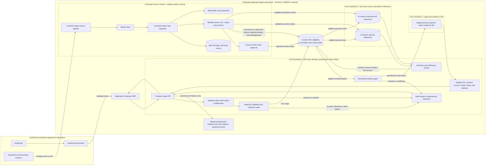

# Azure Production Architecture

## Decision summary

The production design keeps authorization ahead of retrieval. Microsoft Entra ID authenticates
employees; the application resolves trusted group IDs and constructs mandatory Azure AI Search
security filters. Filters are one document-level control, **not** proof that inaccessible content
cannot affect ranking. Only access-equivalent collections may be searched: every document in a
collection must be visible to every principal routed to it. Restricted HR content uses separate
collections and a separate query path as defense in depth.
Preview ACL-aware Search features are an upgrade option after production readiness review,
not a dependency for launch.

The proposed application data plane targets an approved Azure region: use regional Application
Gateway WAF and a regional model deployment, not a global edge or Global/Data Zone model routing.
This is a **deployment condition**, not a residency guarantee. Confirm storage, processing,
replication, backups and telemetry location for each service and the existing Entra/source-system
dependencies before production. If any dependency cannot meet the organization's strict
single-region interpretation, obtain an explicit approved exception or do not launch that path.
An approved regional Azure ML serving option is possible if Azure OpenAI cannot qualify, but it
needs the same location proof. Public network access is disabled on
data services where supported; workloads use managed identities and private endpoints.
Only authorized excerpts reach Azure OpenAI. Retrieved document text is delimited as data,
cannot define system instructions, and cannot invoke tools.
The model is **not implemented in the local app**. The proposed first Azure model
selects approved evidence IDs after authorization; application code renders the
exact claims and verifies citations. See [model placement and contract](azure-model-integration.md)
and [ADR 009](decisions/ADR-009-azure-model-boundary.md).

## Request and content flows

```mermaid
flowchart LR
  subgraph EXTERNAL["Outside the proposed application data plane"]
    U[Employee] --> ID[Existing Entra tenant]
    SP[SharePoint and business sources]
  end
  subgraph REGION["Proposed approved-region data plane - residency validation required"]
    AG[Application Gateway WAF]
    subgraph POLICY["Trust boundary 1: API owns identity, authorization and routing"]
      APP[Container Apps API] --> AUTH[Validate token and trusted entitlements]
      AUTH --> PRE[Read live eligibility and collection state]
      SAFE[Safe denial or dependency response]
      R[Authority and sufficiency checks]
      REV[Reviewed evidence gate]
      V[Validate IDs; recheck access; render claims and citations]
    end
    EL[(Cosmos DB: eligibility, revocation and review state)]
    subgraph SEARCH["Trust boundary 2: rank only access-equivalent collections"]
      SI[(AI Search internal collections)]
      SR[(AI Search restricted HR collections)]
    end
    subgraph MODEL["Trust boundary 3: approved evidence only"]
      AO[Regional Azure OpenAI: select evidence IDs]
    end
    subgraph INGEST["Untrusted source content - validate before serving"]
      AD[Container Apps source adapter] --> SB[Service Bus]
      SB --> ING[Container Apps Jobs ingestion]
      ING --> B[(Blob Storage versioned source)]
      ING --> ACL[Validate owner, ACL, status and revision]
      ACL --> OWNER[Source-owner span approval]
      ING --> Q[Dead letter and quarantine]
    end
    MON[Regional Application Insights and Log Analytics: sanitized events]
  end
  ID -->|validated token| AG --> APP
  AUTH -->|unknown or denied| SAFE
  PRE -->|no safe collection or store failure| SAFE
  PRE -->|live scope| EL
  EL -->|eligible internal route| SI
  EL -->|eligible restricted route| SR
  SI --> R
  SR --> R
  R -->|recheck current revision and access| EL
  EL -->|eligible reviewed spans| REV
  REV -->|missing or conflicting| SAFE
  REV -->|bounded IDs and spans| AO --> V --> APP
  SAFE --> APP --> AG
  APP -->|outcome and latency only| MON
  SP -->|change event or poll| AD
  ACL -->|revocation or retirement blocks collection before acknowledgement| EL
  OWNER -->|approved review state| EL
  ACL -->|validated current chunks| SI
  ACL -->|validated restricted chunks| SR
```

The diagram's regions are trust boundaries, not claims that the existing Entra tenant or
SharePoint sources reside in the chosen Azure region. A caller cannot supply groups, filters, index names,
system prompts or data locations. The API derives identity from the validated Entra token,
loads authorization policy from trusted configuration, chooses the permitted index, and
constructs the filter. Search results are treated as untrusted evidence even after access
control. A safe response is returned before Search if no permitted, clean collection exists.
Ordinary logs record request IDs, outcome categories, latency and deployment IDs; they exclude
questions, excerpts, source identifiers and restricted metadata. Any source-level investigation
requires a separately authorized, audited workflow, not ordinary application telemetry.

## Component map and tradeoffs

| Azure service | Responsibility and reason | Alternative or tradeoff |
|---|---|---|
| Microsoft Entra ID | Employee authentication, app roles and trusted group membership | App-managed roles simplify small deployments but duplicate enterprise identity state |
| Application Gateway WAF v2 | Regional ingress and web attack protection without a global edge | Front Door offers global edge/failover but is incompatible with an unqualified single-region data-path promise |
| API Management (later, if needed) | Centralized quotas, API versioning and policy for multiple consuming apps | Start with application validation and quotas for one API; add APIM when governance justifies it |
| Azure Container Apps | Autoscaling Python query API and background jobs without Kubernetes operations | App Service is simpler for steady web workloads; AKS gives control at much higher operating cost |
| Azure AI Search | Hybrid keyword/vector retrieval, filters, semantic ranking and source fields | Azure SQL Database with application-owned retrieval keeps relational control but adds ranking/indexing engineering; preview native ACL features are deferred |
| Azure Cosmos DB for NoSQL, approved region | Trusted document eligibility, ACL epochs, current revisions and review records; strong consistency for authorization reads, fail closed if unavailable | Azure SQL Database is an Azure alternative when relational constraints and transactions dominate; Cosmos RU cost and partition design need measurement |
| Separate restricted Search index | Physical defense in depth for HR investigation content | One filtered index is cheaper; a filter defect has a larger blast radius |
| Azure OpenAI regional deployment | Optional evidence-ID selection after authorization, sufficiency and review; validate exact processing location | Keep deterministic composition if quality and coverage suffice; permit free phrasing only after independent entailment validation |
| Azure AI Content Safety (optional) | Prompt/jailbreak signal where risk testing shows value | Start with structural isolation and built-in model safety controls; a classifier cannot replace either |
| Blob Storage with versioning and soft delete | Durable regional source snapshots, normalized artifacts and replay | ADLS Gen2 is preferable when hierarchical namespace and POSIX ACLs are required |
| Container Apps source adapter and Service Bus | Source-specific webhooks/change feeds or polling plus durable retries and dead letters; use per-document sessions only if ordered delivery is required | Event Grid is useful for sources with native events; do not assume every source emits them |
| Azure Functions or Container Apps Jobs | Idempotent extraction, ACL validation, chunking and indexing | Search indexers reduce code but offer less control over complex authority/ACL validation |
| Key Vault and managed identities | Secretless service access; certificates or unavoidable secrets remain centralized | Application secrets create rotation and leakage risk |
| Private Link, VNet integration and Private DNS | Remove public data-plane paths between API, Search, Storage, OpenAI and Key Vault | Public endpoints with IP rules are easier but broaden exposure |
| Application Insights, Log Analytics and Azure Monitor | Traces, safe metrics, alerts, dashboards and SLOs | Custom telemetry storage increases ownership and privacy risk |
| Azure Machine Learning registry and pipelines (later) | Governed model/prompt experiment lineage when evaluation volume warrants it | Start with version-controlled datasets and Azure DevOps Pipelines release gates |
| Azure Container Registry and Azure DevOps Pipelines | Image registry, tests, IaC validation and staged deployment | More elaborate MLOps orchestration is deferred until the simple pipeline becomes limiting |

Azure AI Search officially supports document-level security-filter patterns and Entra/RBAC
for service access. Native token/ACL enforcement has preview-dependent variants, so launch uses
explicit group fields and filters in the application boundary. See Microsoft guidance on
[Search security](https://learn.microsoft.com/en-us/azure/search/search-security-best-practices)
and [document-level access](https://learn.microsoft.com/en-us/azure/search/search-document-level-access-overview).
Microsoft recommends private endpoints and managed identities for Azure OpenAI; see
[Azure AI security practices](https://learn.microsoft.com/en-us/azure/security/fundamentals/ai-security-best-practices).
The regional ingress choice follows Microsoft's description of
[Front Door as a global service](https://learn.microsoft.com/en-us/azure/frontdoor/front-door-faq)
and [Application Gateway WAF as regional ingress](https://learn.microsoft.com/en-us/azure/application-gateway/secure-application-gateway).
Model [deployment types](https://learn.microsoft.com/en-us/azure/ai-foundry/model-inference/concepts/deployment-types)
distinguish geography-based, data-zone and global processing; the exact approved-region
guarantee still requires validation for the selected service and contract.

## No-influence serving rule

At collection admission, compute a trusted access-scope signature from source ACLs and
current entitlements. A Search collection is queryable only when **all** its indexed chunks
are permitted for **every** principal routed to that collection. The API may query multiple
permitted collections, de-duplicate candidates and rerank those authorized candidates in
application code; it must not compare raw BM25 scores across different indexes as though
they were calibrated. An arbitrary overlapping ACL that cannot be mapped to a tested
access-equivalent collection is excluded from the answerable search service for the first
launch. It is not placed in a broader index and merely hidden by a result filter.

Revocation, retirement or a group/ACL change can invalidate that signature while stale
chunks remain indexed. Before acknowledging such a change, mark the affected collection
unqueryable in the live eligibility store. Requests needing it receive a safe unavailable
response until deletion/repartitioning and index-content verification finish; only then
re-enable the collection. The pre-search eligibility read and final access recheck protect
against races, while collection quarantine prevents stale content from influencing BM25
statistics during cleanup. This sacrifices some availability rather than weaken the stated
zero-influence requirement. Denied-content mutation tests must compare authorized candidate
sets, ordering and sanitized output/telemetry before any collection is enabled.

## Residency admission decision

The requirement says services and data remain in an approved Azure **region**. A selected
resource region alone is not proof of where a managed service processes, replicates or
backs up every data type. The deployment owner must record a service-specific location
decision before launch:

| Dependency | Evidence needed before launch | If strict region compliance is unproven |
|---|---|---|
| Entra tenant and existing SharePoint/business sources | Tenant/source residency, token and metadata flow, and written scope or exception for pre-existing services | Do not claim these external dependencies are in the application region; obtain an approved exception or stop |
| Azure AI Search, Blob, Cosmos DB, Service Bus and Key Vault | Storage, processing, replication, backups and feature-specific data movement for the selected configuration | Disable the nonconforming feature or do not launch the affected path |
| Azure OpenAI or optional Azure ML model serving | Exact model, deployment type, processing location and logging terms | Use a qualifying regional option or keep model use disabled |
| Application Insights and Log Analytics | Regional workspace, telemetry routing/retention and the sanitized event schema | Disable nonessential telemetry; do not send sensitive payloads to an unapproved location |

Microsoft documents [Entra's geo-based residency model](https://learn.microsoft.com/en-us/entra/fundamentals/data-residency)
and [Azure AI Search's geography-level data-residency terms](https://learn.microsoft.com/en-us/azure/search/search-security-built-in).
Those are not automatically identical to this quest's single-region condition. If the
organization interprets the condition literally and no compliant service configuration
or written exception exists, the proposed architecture is **not approved for deployment**.

## Content lifecycle

Each source change receives a stable business document ID, revision and event ID. Service Bus
uses peek-lock delivery. Workers remain idempotent because redelivery is possible; per-document
sessions and duplicate detection are enabled only if the source event ordering and retry pattern
need them. A worker validates the source owner, classification, ACLs, status, effective date and
supersession, then incrementally uploads or deletes that document's chunks in the active index.
Changed answerable spans are proposed for source-owner review; ingestion does not
approve a span merely because it appears in source text. Unreviewed or changed
spans may be searchable by an authorized user, but cannot become answer claims.
Revision checks prevent an older event from restoring stale content. An ACL revocation or
retirement makes the affected access-equivalent collection unqueryable before the event is
acknowledged, even if the Search index still contains stale chunks. The query API also rechecks
document eligibility before returning evidence. Deletion/repartitioning and collection-content
verification are required before serving resumes. Poison events enter dead-letter/quarantine
with alerts.
Build a separate inactive index generation and switch an alias for schema changes or bulk rebuilds,
not for each of roughly 200 daily document changes. Alias propagation is not instantaneous, so
retain the old index during the transition and test both paths.
Microsoft documents these retry and idempotency expectations in its guidance for
[Service Bus message processing](https://learn.microsoft.com/en-us/azure/service-bus-messaging/service-bus-message-loss-and-duplicates).
The incremental path uses Search [document indexing actions](https://learn.microsoft.com/en-us/azure/search/search-how-to-load-search-index);
[index aliases](https://learn.microsoft.com/en-us/azure/search/search-how-to-alias)
are reserved for rebuilds. [Service Bus sessions](https://learn.microsoft.com/en-us/azure/service-bus-messaging/message-sessions)
provide FIFO ordering when it is actually needed.

## Scale latency reliability and cost

Size the Search SKU from measured index expansion, chunk counts and query load for
60,000 documents / 180 GB and 5,000 employees, then test replicas at 20 peak
requests per second while processing approximately 200 daily content changes.
The source estate size alone is not a capacity estimate. Proposed stage deadlines
total 5.5 seconds: edge/API 250 ms, identity/policy 250 ms, Search 1.0 s,
authority/reranking 500 ms, model 3.0 s and verification/serialization 500 ms.
This leaves 500 ms against the required end-to-end p95 below six seconds.
Stage deadlines are an allocation, not a measured p95 or an additive percentile proof;
load-test the whole request path, including queueing, before claiming the SLO.
Timeouts are shorter than the remaining request budget. A high-risk request returns a safe
dependency-unavailable response if authorization, Search or verification fails; it does not fall
back to an unfiltered query or ungrounded model answer.

### Proposed production acceptance checks (not measured results)

| Gate | Launch test and proposed decision rule |
|---|---|
| Authorization and ranking isolation | Mutate denied text, titles and counts; unauthorized candidate sets, ordering, answer, citations and ordinary telemetry must remain unchanged. Any difference blocks launch. Repeat during ACL changes and index rebuilds. |
| Revocation and retirement | Once a change event is accepted, no query may hit an affected dirty collection. Race and replay tests must show a safe response until physical cleanup and collection verification complete. Any stale hit or influence blocks launch. |
| End-to-end experience | Load-test at 20 requests/second, a 5,000-employee entitlement distribution and concurrent 200-change/business-day ingestion against a production-shaped 60,000-document / 180-GB source estate. Measured end-to-end p95, including queueing, must be below 6 seconds. |
| Ordinary content freshness | Proposed pilot target: approved changes searchable within 15 minutes after source-owner approval, measured at the stated change rate. Track source-to-approval delay separately; agree the business freshness SLO before launch. Misses beyond the approved SLO block rollout. |
| Cost and reliability | Set an owner-approved monthly and per-answer budget before pilot; measure actual Search units, model tokens, ingestion and telemetry cost under load. Alert at 80% of the budget and block promotion above 100%. Dependency and regional-outage drills must return safe responses for high-risk requests. |

The numbers above are design targets, not evidence of Azure performance. If the 15-minute
freshness proposal or budget is unsuitable, the business owner must approve replacements
before the launch gate is executable. No Azure load test has been run for this assessment.

Cache only permission-independent configuration by default. If response caching is later
justified, key it by authorization scope, ACL epoch, index generation and question fingerprint;
invalidate it on entitlement or source changes, and prove denied-content non-influence before
enabling it. Autoscale API replicas on concurrent requests and
Service Bus workers on queue depth. Search replica/partition utilization, model token budgets,
prompt/output caps and per-request cost are dashboarded. Use consumption-based compute where
bursty, reservations after stable measurement, lifecycle tiers for old Blob versions, and separate
cost alerts by environment and service.

Region failure behavior is explicitly chosen with the business owner because the residency rule
may restrict a paired region. Storage uses zone redundancy where available. Service Bus Premium
Geo-Replication is an option when an approved secondary region exists; Microsoft notes failover
promotion is operator initiated. Search indexes are reproducible from Blob snapshots and the event
log. The safest initial outage behavior is a safe dependency response for all live knowledge
requests. Add any cached public-policy mode only after revocation freshness is proven; never use
it for restricted or high-risk requests.

## Evaluation release and operations

Every release runs unit tests, the version-controlled business cases, paraphrases, adversarial ACL
mutations, malicious-content cases, citation entailment checks, latency tests and cost estimates.
Unauthorized influence, unsupported claims, retired authority, failed commands or missing citations
block promotion. Deploy with infrastructure as code, immutable images, a staging index alias and
canary traffic. Roll back the application revision and Search alias independently.

Alerts cover authorization denials, empty/low-confidence evidence, citation verification failures,
Search/model dependency failures, p95 latency, token/cost budgets, stale content, queue age, dead
letters and deletion lag. Security teams receive sanitized event categories; elevated investigation
access is separate, audited and never enabled in ordinary application telemetry.

## Migration priorities

1. Build identity-aware ingestion and filtered Search first. Reproduce the local authorization,
   version, retirement and citation tests against a small production-shaped index before model use.
2. Build the evaluation and safe observability gate second. Establish release blockers, trace-safe
   metrics, latency/cost baselines and rollback before widening content or traffic.

Then add Azure OpenAI behind reviewed-evidence sufficiency and claim verification, migrate sources in waves,
compare permission-consistent outcomes, and promote traffic only after source owners validate each
collection. The local deterministic path remains a regression oracle and degraded-mode option.

## Remaining decisions

The Cosmos DB eligibility store is read before retrieval to construct live eligible
candidate filters and again before output; a post-search revocation check alone
is insufficient for the no-influence requirement. Use strong reads without a stale
authorization cache, reject revision races, and fail closed on store outages.
See Microsoft's [consistency choices](https://learn.microsoft.com/en-us/azure/cosmos-db/consistency-levels).

Security filters do not by themselves prove zero ranking influence: BM25 uses
index statistics, so denied documents in a mixed-access index may affect scores.
The access-equivalent collection rule above is a proposed control, not a proven
guarantee of this prototype. Arbitrary overlapping ACLs, index fan-out and
freshness must be benchmarked; do not launch a collection that fails either
isolation or latency acceptance.
Microsoft describes the [statistics used by Search scoring](https://learn.microsoft.com/en-us/azure/search/index-similarity-and-scoring).

Confirm the approved region and paired-region policy, source systems and ACL semantics, retention
requirements, Search SKU/load-test results, model deployment availability, recovery objectives,
and whether preview ACL capabilities can pass enterprise production review. These are design inputs,
not reasons to deploy resources for this assessment.
