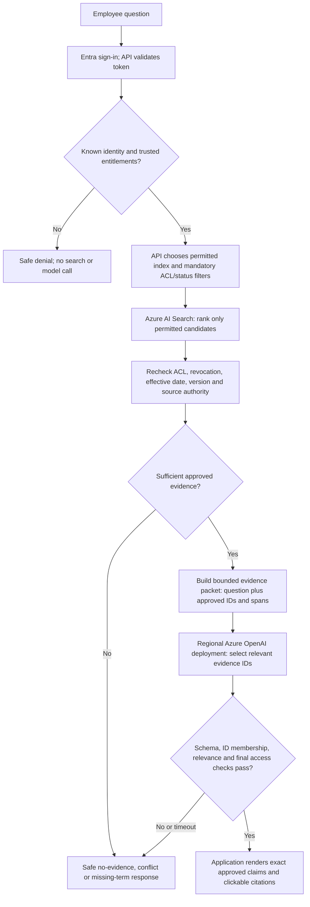

# Where the AI model fits in the Azure design

**Status:** production proposal, not deployed or part of the CPU-only assessed
runtime. The current local app uses deterministic retrieval and extraction; it
does not call an LLM, embedding model, or agent framework. The model is optional
for the hiring quest. This design explains how to add one without moving the
security boundary into a prompt.

## One-sentence explanation

The application decides **who may see which current evidence**; Azure AI Search
finds within that allowed set; an Azure-hosted model helps choose relevant
approved evidence; application code verifies and renders the answer with source
citations. The model never grants access or invents a missing fact.

## Employee question path



The model call is deliberately **after** authorization, Search, current-source
resolution and reviewed-evidence approval. The application owns the system
instructions, schema, index routing and citation map. Retrieved documents are
delimited as untrusted data. A document that says “ignore the rules” cannot
change an entitlement, choose an index, invoke a tool or edit the trusted prompt.
No agent loop or model tools are needed for this first production version.

For the vendor example, Procurement can search the current vendor policy and
approval matrix; the retired version is not an authoritative candidate. For
the Engineering HR-case example, the restricted index is not queried and the
case cannot affect Search scores, model input, output, citations or ordinary
telemetry. For NexaServe, finding the contract does not authorize a numeric
first-response target: the sufficiency gate identifies the missing executed
schedule before the model can draft a commitment.

## Narrow model contract for a first launch

Input is a bounded packet of the user's question and **only** the eligible
approved evidence, each with an opaque evidence ID, source version, approved
span and citation reference. Do not include denied-document counts, titles or
excerpts. Output uses a strict structured schema such as:

```json
{
  "selected_evidence_ids": ["ev-01", "ev-03"],
  "needs_clarification": false
}
```

These are illustrative IDs, not mandatory-question answers. The API rejects
unknown, duplicate, stale or unauthorized IDs, limits selection count and
rechecks access immediately before response. It then renders the selected
approved spans **verbatim** with app-owned citations and notices. The model
does not supply the final claim text, an ACL, a citation URL, an outcome state,
or an SLA value. Structured output constrains shape; it is not proof of truth.
Selection quality still needs relevance tests and human review.

This intentionally gives the model a modest job: interpreting broader wording
and selecting/ordering evidence. It avoids pretending that a JSON response or
a citation proves a model-written sentence. A later phase may allow concise
paraphrases only after an independent claim-to-evidence verifier, adversarial
tests, calibrated abstention thresholds and source-owner sign-off show that
every important sentence remains supported. If that gate is not ready, retain
verbatim claims or the local deterministic composer. Model failure never
triggers an ungrounded fallback.

## Reviewed evidence at enterprise scale

The local `approved_spans.json` is a small, explicit demonstration—not a plan
to manually edit one JSON entry for every chunk of 60,000 documents. Production
ingestion must preserve document ID, version, owner, classification, ACL,
effective status, line/span hash and review state in trusted records. A source
owner or delegated reviewer approves answerable facts/spans or a validated
document revision. The ingestion worker may **propose** changed spans but cannot
auto-approve them from document prose. Changed, retired, revoked, inconsistent
or unreviewed spans are unavailable for claims until the required checks pass.
The query path rechecks live eligibility even if Search still contains an old
copy. This approval workflow and its staffing/coverage are production design
dependencies, not completed features of the local app.

## Service placement and operating choices

| Component | Job | Must not do |
|---|---|---|
| Entra ID + query API | Authenticate, resolve trusted groups, enforce application policy | Trust a user-supplied employee label as authentication |
| Azure AI Search | Lexical retrieval first; optionally hybrid/vector later with mandatory security prefilter | Search or rank denied content and filter it only afterward |
| Trusted eligibility/review store | Track current revision, revocation and approved evidence | Derive permission or approval from document instructions |
| Regional Azure OpenAI deployment | Select relevant evidence IDs from an already safe packet | Directly search, call tools, create citations or decide permissions |
| Application output gate | Validate IDs, recheck access, render exact claims/citations, abstain on failure | Treat structured model output as evidence |

Start with text Search and one regional model deployment **only if** measured
coverage improves enough to justify latency, cost and data-processing review.
Embeddings or hybrid retrieval are optional later; when used, the ACL filter
must narrow the candidate set before vector ranking. The exact model/version,
regional availability, processing terms, approved Azure region, capacity and
cost must be confirmed with the organization before deployment. Global or
Data Zone routing is not a substitute for a strict single-region requirement.
Use managed identities, private endpoints and bounded timeouts; log outcome
categories and latency without raw questions or restricted passages by default.
Optional Prompt Shields can add a signal for document attacks but cannot replace
authorization, reviewed evidence or output verification.

## Failure and release checks

| Event | Required behavior |
|---|---|
| Unknown user or missing ACL metadata | Deny before Search or model call |
| Restricted or retired document | No ranking influence, model input, citation or content log |
| ACL revoked after indexing | Live eligibility gate blocks it before model input and again before response |
| No binding SLA or conflicting current versions | Safe, useful uncertainty; no model-created number |
| Changed source span without approval | Abstain until reviewed; never auto-approve from text |
| Model timeout, invalid schema, unknown ID or unsupported selection | Safe response; no ungrounded fallback |
| Model or Search outage | Dependency-safe response; no unfiltered retrieval |

Promote only after permission-isolation tests, current/retired and missing-term
cases, changed-source/revocation races, document-injection probes, citation
integrity, model-selection relevance, latency/cost and reviewer access tests
pass. Keep the existing local deterministic suite as a regression oracle, not
as proof that the Azure proposal is already implemented.

## Current Microsoft guidance checked 2026-09-25

- [Azure AI Search security-filter pattern](https://learn.microsoft.com/en-us/azure/search/search-security-trimming-for-azure-search) explains application-built identity filters and explicitly notes that the principal string is not itself authentication.
- [Vector query filters](https://learn.microsoft.com/en-us/azure/search/vector-search-filters) distinguish prefiltering from postfiltering; use a mandatory prefilter if vectors are later added.
- [Foundry deployment architecture](https://learn.microsoft.com/en-us/azure/foundry/concepts/architecture) distinguishes single-region Standard/Regional Provisioned from Global and Data Zone processing.
- [Structured outputs](https://learn.microsoft.com/en-us/azure/foundry/openai/how-to/structured-outputs) support a JSON-schema response shape; application validation remains necessary.
- [Prompt Shields](https://learn.microsoft.com/en-us/azure/ai-services/content-safety/quickstart-jailbreak) can detect user and document attacks but are supplemental.
