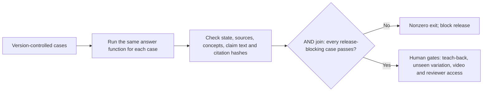

# ApexOne process model

This is an interview map of the implementation, not a new authority for business
answers. The local path is implemented and tested; the Azure path below is a
production design only. The local user selector simulates an authenticated identity.

## Local request flow

The gateway labels describe decision logic, not parallel background jobs or a
BPMN engine. **XOR** means exactly one path is taken. **Inclusive OR** means
one or more eligible sources may contribute and their candidate sets are
merged. **AND** means every required condition or claim must pass; its join
waits for all required results. An empty optional branch contributes nothing.

After identity and input checks, a standalone greeting or help request takes a
short trusted `small_talk` path with no document claim or citation. A greeting
attached to a substantive question is removed and follows the normal
authorization-before-search path below. The final output gate verifies the
small-talk reply against the application's finite set of permitted messages.

```mermaid
flowchart TD
  U[Select demo identity and ask] --> ENTRY{XOR: entry point}
  ENTRY -->|Browser| UI[Local UI]
  ENTRY -->|Terminal| CLI[CLI]
  UI --> CORE[Shared answer function]
  CLI --> CORE
  PACK[(Trusted identity, entitlement, manifest and corpus records)] --> CAT[Catalog]
  CAT --> CORE
  CORE --> VALID{XOR: known identity and valid question?}
  VALID -->|No| SAFE[Safe state: no claims or citations]
  VALID -->|Yes| AUTH[For each document: AND all trusted authorization checks]
  AUTH --> AJ{AND join: only documents passing every check}
  AJ --> ELIG[Apply status, date and relevance eligibility]
  ELIG --> SOURCES{Inclusive OR: eligible authorized sources}
  SOURCES -->|One or more topic matches| HINT[Non-authoritative topic boosts]
  SOURCES -->|All eligible sources| LEX[Lexical candidate scoring]
  HINT --> MERGE{Inclusive OR join: merge candidate signals}
  LEX --> MERGE
  MERGE --> RET[Rank authorized chunks only]
  RET --> EVID{XOR: relevant evidence?}
  EVID -->|No| SAFE
  EVID -->|Yes| DEC[Check current versions and source authority]
  DEC --> CONFLICT{XOR: conflict or chosen intent?}
  CONFLICT -->|Conflicting current versions| SAFE
  CONFLICT -->|One selected intent| ROUTE[Select the intent-specific evidence requirements]
  ROUTE --> CLAIMS[Extract exact source spans; require reviewed approval]
  CLAIMS --> CJ{AND join: all required claims valid?}
  CJ -->|No| SAFE
  CJ -->|Yes| OUT[Answer or qualified answer with citations]
  SAFE --> GATE{AND join: output schema, authorized and reviewed spans, hashes and format valid?}
  OUT --> GATE
  GATE -->|Yes| PRESENT{XOR: output channel}
  GATE -->|No| FALLBACK[Insufficient evidence; no claims or citations]
  FALLBACK --> PRESENT
  PRESENT -->|Browser| DISPLAY[Plain-text claims and separate sources]
  PRESENT -->|Terminal| JSON[JSON response]
```

The inclusive branch describes the **set of eligible documents**: policy,
matrix, advisory, contract, or other authorized sources can all be candidates.
It does not mean topic hints are required or that the app starts concurrent
searches. A hint only adjusts ranking after authorization; a question without
a hint still takes the lexical path. The answer router currently selects one
intent by precedence, so a multi-topic question is **not** decomposed into
multiple subquestions.

The claim AND join is intentionally strict. For example, the vendor path needs
the current policy's scope, process and control spans *and* the related approval
matrix span; if one required span is absent or fails validation, the answer
abstains. Renewal similarly needs both policy and scoped Legal advisory. This
is logical conjunction, not four workers running in parallel. The contract
path may still return `insufficient_evidence` with a cited clause when the
clause establishes that a first-response target is missing.

The important boundary is **AUTH before RET**. A denied document never becomes a
chunk or a ranked candidate. The catalog loads the normalized records at startup,
but document text is not indexed, scored, logged, or used for an answer until the
trusted authorization checks admit that document. The local implementation does
not claim constant-time behavior or isolation from every malformed shared-file
failure.

| Step | What decides it | Code to inspect | Failure behavior |
|---|---|---|---|
| 1. Input | Supplied user ID and question | `ui.py` or `__main__.py` | Bad or unknown identity cannot retrieve |
| 2. Authorization | Trusted groups, classification, document allow/deny, metadata agreement | `access.py` | Missing or inconsistent data denies the document |
| 3. Retrieval | Date/status eligibility, identifier/relevance checks, lexical chunk ranking | `retrieval.py` | No authorized match returns no evidence |
| 3a. Topic hints | Topic keywords mapped to already authorized, eligible document IDs | `hypercontext.json` and `context.py` | Hints only boost relevant ranking; no match falls back to normal search |
| 4. Answer decision | Current source, scoped advisory, missing SLA, conflicts, unverified status | `assistant.py` | Safe uncertainty or warning |
| 5. Proof | Reviewed exact normalized lines and citation hash for every claim | `assistant.py`, `reviewed.py`, `approved_spans.json` | Changed or unapproved spans are not emitted |
| 5a. Final gate | Trusted output contract, current authorized source view, exact claim/span and citation checks | `hypercontext.json`, `context.py`, `safety.py` | Invalid output becomes `insufficient_evidence` without claims/citations |
| 6. Presentation | Same core result to CLI or optional UI; viewer rechecks access and citation hash before showing normalized source lines | `__main__.py`, `ui.py`, `web/app.js` | UI cannot add authority; no history is sent as evidence |

## Four concrete walks

1. **Vendor approval:** Procurement is allowed to see the current vendor policy
   and matrix. Retired policy does not compete for current guidance. The answer
   extracts process stages and the matrix relationship with source-line references.
2. **NexaServe response time:** The authorized agreement is found, but it does
   not establish a numeric first-response SLA and has no executed Schedule C.
   Finding a relevant document is therefore not the same as having enough evidence.
3. **HR case:** Engineering receives `no_authorized_evidence`, without a source
   reference or confirmation of a restricted record. HR may receive the case
   passage and its citation. Changing demo identity clears visible prior messages.
4. **Legacy migration note:** An authorized but unverified note can provide
   factual migration evidence, with a warning. Embedded instructions remain
   document text; they cannot change permissions, application policy, or tools.

## Evaluation and release flow

The fixed evaluator covers the four mandatory incident families and currently
passes ten cases. It is a regression gate, not proof that arbitrary future
questions or source layouts will work. The current report intentionally says
`submission_ready: false` until human gates are complete.
The evaluator's `passed` flag joins only cases marked `release_blocking`; a
failure in a non-blocking case is still reported but does not flip that flag.
All ten committed cases are release-blocking. This behavior is a limitation
to review if the suite grows, not a claim that every reported failure blocks.

The UI's per-employee topic/file tree and its non-authoritative search hints are
explained in `docs/hypercontext-and-ui.md`. The topic map does not change the
access, authority, or claim-support boundaries shown above.

## Azure design, not local runtime

The production design replaces the local demo identity with a validated Entra
identity and derives groups server-side. The API constructs mandatory document
filters before Azure AI Search; restricted HR content has a separate search
route/index. A content-update path validates metadata and ACLs before indexing,
with immediate revocation checks before excerpts can reach a regional model.
The first proposed model selects from **authorized, current, reviewed** evidence
IDs; application code validates the selection and renders exact claims. Later
model-authored phrasing would need an independent entailment gate. See
`docs/azure-model-integration.md` and `docs/azure-architecture.md` for the full
contract and service tradeoffs. None of those Azure services run locally.

## Teach-back exercise

Trace a question for an unknown user through the first diagram. Then explain why
moving authorization after ranking would be unsafe. Finally, change a policy
threshold in a disposable corpus copy: predict safe abstention until review and
a changed citation hash after approval. This should be done by the candidate,
not counted as complete merely because this model exists.
